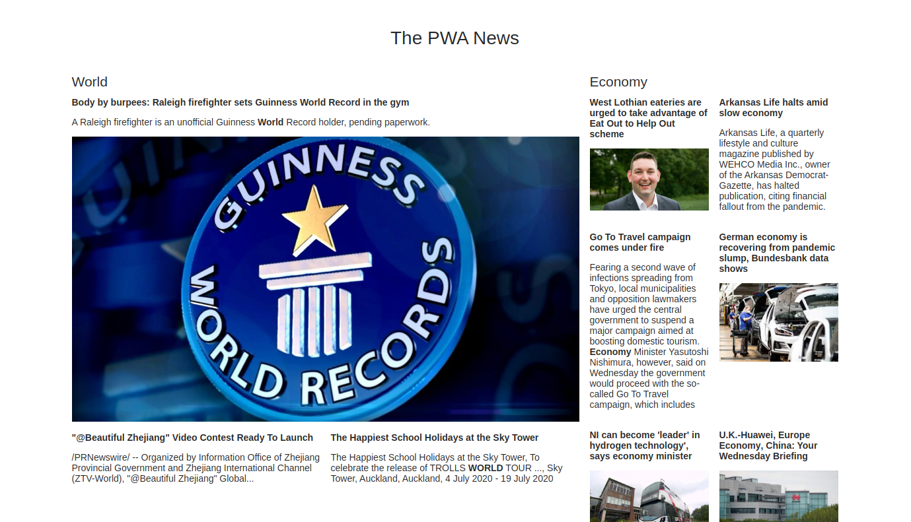

# The PWA News

This project was with React.js and use PWA. This is site newsletter.

## Getting Started

In the project directory, you can run:

### `yarn start`

Runs the app in the development mode.\
Open [http://localhost:3000](http://localhost:3000) to view it in the browser.

The page will reload if you make edits.\
You will also see any lint errors in the console.

### Deploy on Netlify

The project is deployed at the following link: [The PWA News](https://the-pwa-news.netlify.app)
